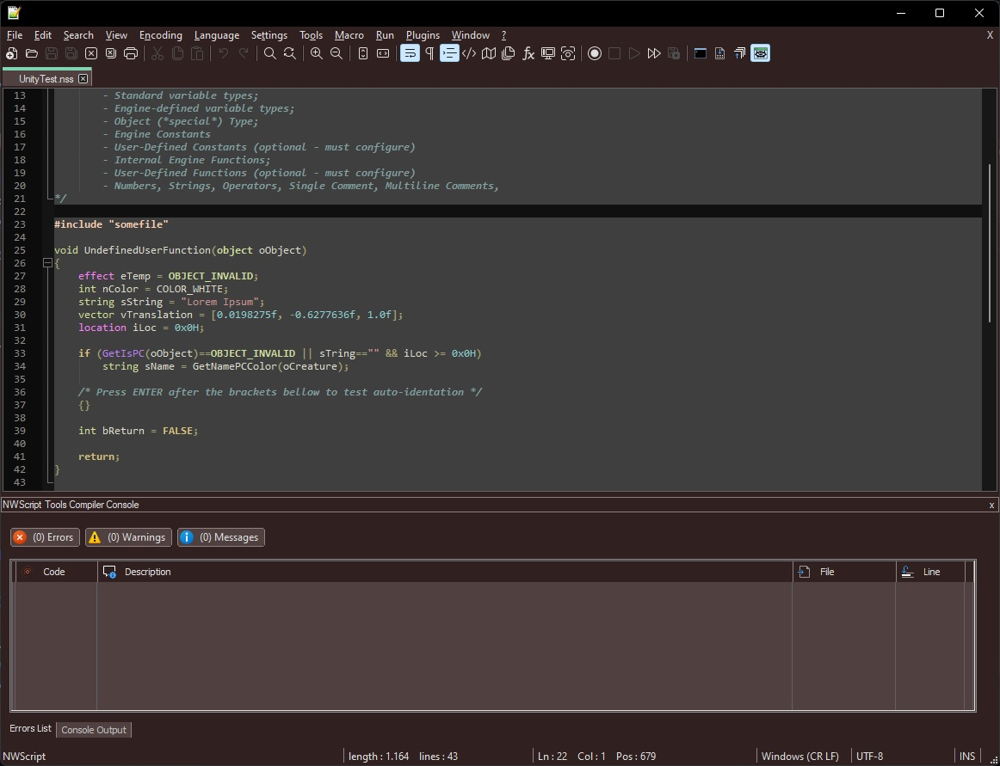

 
 # NWScript Tools for Notepad++

Since there's not much functionality to User-Defined Languages in [`Notepad++`](https://notepad-plus-plus.org/) I decided to create a custom `Lexer` to support [`Bioware's NWScript language`](https://en.wikipedia.org/wiki/NWScript). A [`Lexer`](https://en.wikipedia.org/wiki/Lexical_analysis) is just a program that can read, interpret and highlight programming code syntax. 

But in this plugin, things rapidly expanded, so I also decided to provide the tools to compile and publish `NWScript` files directly into the target games: **`Neverwinter Nights` [`Enhanced`](https://www.beamdog.com/games/neverwinter-nights-enhanced/)** and **[`2`](https://dnd.wizards.com/products/digital-games/pcmac/neverwinter-nights-2-complete)** (this one still a Work In Progress).

The plugin adds support for function Auto-Completion and can import newly defined functions from `nwscripts.nss` (the main Neverwinter engine header).


## Installation
Just download the latest release and put it into `Notepad++` `plugins directory`, overwritting any existing files or folders there.
- The plugin requires it's XML to be properly placed on the **`plugins/Config/`** folder in `Notepad++` in order for it to work, or else it will be marked as **`“incompatible”`** and asked to uninstall.

```
Here is a sample of the plugin's funcionality:
```
<div align="center"></div>
<p></p>
<p></p>

```
Dark Mode version:
```
<div align="center"></div>
<p></p>


The unity test file I used to take this screenshot is provided [here](Media/UnityTest.nss).

## Known Issues
***`Up to Notepad++ 8.3.2 and prior versions`***: 

- To use the plugin's built-in auto-indentation, you must first disable `Notepad++'s` Auto-Indentation function:
```
Settings -> Auto-Completion -> Auto-Indent (checkbox)
```
- Also while playing back a macro, especially the type-in ones, you'll want to disable the Plugin's auto-indent feature, as the plugin will not be able to detect a macro playback and will end messing-up any text typed within that macro.

***`From Notepad++ version 8.3.3 and beyond`***

- Those issues were fixed *(thanks [`@DonHo`](https://github.com/donho) for accepting my pull request)* and no longer a concern, the option to select the plugin built-in auto-indentation won't even show up as an option to it's users anymore. So I suggest you to always keep your `Notepad++` version up-to-date.
*(if not possible because you use legacy plugins, well, just use the built-in auto-indent function then, it won't bite, I promise)*.

## Informations For Plugin Developers, Students and Code Explorers
<details><summary>Click here to expand</summary><br>
	
This plugin is based on [Notepad++ plugin template](https://github.com/npp-plugins/plugintemplate) and the official [`Scintilla`](https://www.scintilla.org/) `C++ Lexer`. I managed to rewrite much of the code, clear and organize classes, so anyone desiring to write future lexers will find it much easier to integrate a new lexer inside the Plugin. Just put your `LexXXX.cpp` file on the project and add it to the [`Lexer Catalogue`](src/Lexers/LexerCatalogue.cpp) and export it as a `DLL`.

Also, for the `NWScript` compilation, I *“borrowed”* the [`nwnsc`](https://github.com/Leonard-The-Wise/nwnsc) code, since trying to write a compiler from scratch would be a monstrous task.

As for the [`PCRE2`](PCRE/) folder up there... this is because during development and testing, I found out that this is the best `regex` engine out there, far superseding `std::regex` library, and even the `boost` version, at least for the purpose of this project. See the [`development trivia`](#trivia) section down bellow for more info.

All files under this project are provided under the [`GPL v3.0 License`](license.txt).

For reutilization of the project, the `NWScript-Npp.vcxproj` is organized in the following way:

- **`Custom Lexers`**: Here you'll write your new custom Lexers (example: [`LexNWScript.cpp`](src/Lexers/LexNWScript.cpp)) and edit/place them inside [`LexerCatalogue.cpp`](src/Lexers/LexerCatalogue.cpp) `InstalledLexers[]` static object for the code to auto-initialize it upon plugin load. Something like this:
	
    ``` C++
    constexpr static LexerDefinition InstalledLexers[] = {
	{"YourLexerName", TEXT("Your Lexer Status Text"), ANY_NUMBER, 
	   LexerScript::LexerFactoryFunction, ExternalLexerAutoIndentMode::XXX},
    };
    ```
	
    * Where:
        * `YourLexerName` is a 16 bytes-length string;
        * `Your Lexer Status Text` is a 32 bytes-length string (that will be displayed in Notepad++ status bar on the bottom of the screen);
        * `ANY_NUMBER` is just a number to uniquely-identify the Lexer inside your code (this is not used by `Notepad++` in any way, this is just an internal number and you can set to `0` if wanted ). In my case I <code>#defined</code> a `MACRO` for this;
        * A pointer to a [`“Factory”`](https://en.wikipedia.org/wiki/Factory_method_pattern) function to get your lexer's instantiated object. In my case it just returns a new `LexerNWScript` class pointer - which implements the [`ILexer5`](https://www.scintilla.org/LexillaDoc.html) interface. Like this:<br><br>
	
        ``` C++
        static ILexer5* LexerFactoryNWScript() {
	        return new LexerNWScript(ConstructorVariables, ...);
        }
        ```
	
        * The <code>ExternalLexerAutoIndentMode</code> <code>enum class</code>. This is a new feature I developed for `Notepad++` to help plugins dealing with auto-indentation. Prior to `Notepad++ version 8.3.3`, if you tried to perform a custom-made auto-indentation with your plugin, and `Notepad++` had it's Auto-Indentation preference set to `ON`, it would override your plugin behavior and you wouldn't be able to properly auto-indent user inputs. So from `8.3.3` version and forward, since this is not a standard <code>ILexer5</code> functionality, you'll be able to send `Notepad++` the message <code>NPPM_SETEXTERNALLEXERAUTOINDENTMODE</code> to make `Notepad++` work in 3 different ways about auto-indentation with your custom language: <code>Standard</code>, which will tell `Notepad++` to perform the default behavior (to just maintain any amount of tab spacing of previous line), <code>C_Like</code> to tell `Notepad++` your code support a C-Like syntax indentation-> which will read any curly brackets <code>{</code> before a new line and advance the indent amount by one on the next line and then read the other paired curly bracket <code>}</code> and go back one step in indentation... or you can tell `Notepad++` that your plugin does <code>Custom</code> indentation, so `Notepad++` won't perform ANY kind of auto-indent for your plugin lexer, even if it's set to <code>ON</code> inside the user's preferences - because now your plugin will be the one responsible for handling it. You can query `Notepad++` about this user setting with the <code>NPPM_ISAUTOINDENTON</code> message. For more info, just study the code, especially the methods <code>SetAutoIndentSupport()</code> and <code>LoadNotepadLexer()</code> inside my [`PluginMain.cpp`](src/PluginMain.cpp) class, also along with <code>ProcessMessagesSci()</code>, especially the <code>SCN_CHARADDED</code> message processing, to see how my plugin handles auto-indentation with newer and older versions of `Notepad++`. That field is only present there (on <code>InstalledLexers[]</code> variable) to help you if you want your plugin to have more than one `lexer` installed, so you can checkup which `lexers` are installed and to keep track of which auto-indent `mode` they use. `Notepad++` will never need or read that value in any way. Again, check the <code>SetAutoIndentSupport()</code> and <code>LoadNotepadLexer()</code> methods to understand this ***“language auto-indentation”*** thing better. ***(I also strongly suggest studying `Notepad++'s` <code>maintainIndentation()</code> method inside [`NotepadPlus.cpp`](https://github.com/notepad-plus-plus/notepad-plus-plus/blob/master/PowerEditor/src/Notepad_plus.cpp) file so you can see how `Notepad++` performs it's own auto-indentation functionality).***
	
- **`Notepad Controls`**: Contains some class templates to display dialog boxes. Versions of `Static`, `Modal` and `Dockable` dialogs boxes are avaliable.

- **`Plugin Interface`**: Contains all code necessary to initialize the DLL and communicate with `Notepad++` main executable, including the Lexer part. You probably won't need to change *(much of)* this code, **EXCEPT** to make it point to YOUR plugin class(es) instead of mine's.

- **`Resource Files`**: Contains the [XML](src/Lexers/Config/NWScript-Npp.xml) necessary for the Lexer to work with `Notepad++`. Without it, `Notepad++` will just mark your plugin as `incompatible`. It will be copied to the `%notepadInstall%/plugin/Config` folder automatically uppon a successful build.
     * Also contains a [`.targets`](Publish.Dll.To.Notepad.targets) file that is imported inside the [`vcxproj`](NWScript-Npp/NWScript-Npp.vcxproj) [`MSBuild`](https://docs.microsoft.com/en-us/visualstudio/msbuild/msbuild?view=vs-2022) project file to automate deployment of the plugin `DLL` and its associated `XML` to `Notepad++'s` install directory to help you with your plugin debugging. Make sure `Notepad++` isn't running when you build your code. Also make sure to give yourself **write permissions** to the Notepad/plugin installation folder and subfolders, so the compiler can copy the output `DLL` and the annexed `XML` styler to that path. You'll be notified if it cannot and also the build will fail and the debugger will not run if it can't deploy at least the `DLL` there (the `XML` deploying is optional and only emits a warning).
     * Also, I've setup a [`ProjectVersion.rc`](src/ProjectVersion.rc) file along with a header called [`ProjectVersion.h`](src/ProjectVersion.h) to perform auto-increments  on the <code>VS_VERSION_INFO</code> associated resource. This works as following:
	* Every time you hit the <kbd>build</kbd> command in Visual Studio, a [pre-build event](https://docs.microsoft.com/en-us/visualstudio/ide/specifying-custom-build-events-in-visual-studio?view=vs-2022) occurs, which calls this [`PowerShell`](IncrementBuild.ps1) script on the project root that will edit `ProjectVersion.h` and increment the <code>VERSION_BUILD</code> macro inside that file.
         * Then the pre-compiler will read that macro and since <code>VS_VERSION_INFO</code> is setup to use macros for replacing version information, it will compile with whichever version is printed on ProjectVersion.h at the time of compilation.
         * Hence I advise you to ***`NEVER`*** touch or edit `ProjectVersion.rc` inside the [`Resource Editor`](https://docs.microsoft.com/en-us/cpp/windows/resource-editors?view=msvc-170), or it will overwrite and destroy the macros inside and cause you to lose the `build auto-increment` funcionality. Edit it manually (inside any ***raw text editor***) and ***`only`*** to change other info, like `DLL Name`, `Company Name`, `Copyright Info`, etc and leave all the macros there about versioning untouched.
         * To increment major, minor or patch numbers, edit the `ProjectVersion.h` file instead. Only `build` numbers are setup to auto-increment on my script, so if you want your `major`, `minor` or `patch` versions to change, you'll have do it manually, editting their respective <code>VERSION_MAJOR</code>, <code>VERSION_MINOR</code> and <code>VERSION_PATCH</code> macros *(leave <code>VERSION_STRING</code> and <code>VERSION_STRING_BUILD</code> alone as they are)*. I designed this intentionally, since every person or team have its own standards for managing project versions.
	
- **`Utils`**: Contains utilitary headers and code to help dealing with settings, `.ini` files, `regular expressions`, etc.

- **`Root Directory`**: This is where the Plugin code really begins. I designed a base [`Singleton`](https://en.wikipedia.org/wiki/Singleton_pattern) class called [`PluginMain`](src/PluginMain.h) to setup the Menu Commands, to deal with message processing, and all of the main plugin funcions, because, yeah... it will be created only once during a session or DLL loading. You'll need to change this as suitable. Perhaps in the future I'll clean up the code from my specific usage and leave a framework for others to developed upon. No promises made, though **(and hey, it's easy to delete a `PluginMain.cpp` and add your own class... just don't forget to update `PluginInterface.cpp` to point to your own classes instead of mine for handling plugin initialization, message parsing, etc)**.
   * Also, since many plugins use `.ini` files to store their settings, I already provided a [`Settings.cpp`](/src/Settings.cpp) class that will do that *(almost)* automatically for you. Just replace my variables with yours, update the <code>Save()</code> and <code>Load()</code> functions to save/load your variables instead and you're done. The Settings class uses a modified version of [`MiniINI`](https://github.com/pulzed/mINI/blob/master/src/mini/ini.h) API to handle ini files reading, writting, etc., so it's really simple to use instead of writting your own version. It supports `ANSI` and `UNICODE` files and filenames.
   * And the `Common.h` file is just a bunch of aggregated functions I wrote myself or captured over the web, to help me dealing with unicode strings, conversions, Windows Icon and Bitmap handling, etc... (the method I developed for the `Notepad++` auto-restart functionality with a temporary [`batch`](https://www.windowscentral.com/how-create-and-run-batch-file-windows-10) file involved into a [`ShellExecute`](https://docs.microsoft.com/en-us/windows/win32/shell/launch) API call was kind of... crusty... :rofl: but since I did not know of any other method out there and was a bit lazy to research more on this when I was writting features, well... I'll just leave that there... for now. :innocent:).
	
- **Last** but not least: `Plugin Dialogs` are just the instanced versions of `Notepad Controls` classes, to manage MY specific dialog boxes, etc. You really don't need these, except if you want to use them as examples.
	
> ***All other files on this project are just internal work for my plugin specific funcionalities, and hence I will not be providing too much information on them here. I consider the code at least reasonably documented and commented already anyway, so feel free to explore it by yourself.***

	
### Some Project Setup Remarks

- [`NWScript-Npp.vcxproj`](NWScript-Npp/NWScript-Npp.vcxproj) file sets the `<PlatformToolset>` to [`v143`](https://docs.microsoft.com/en-us/cpp/overview/visual-cpp-tools-and-features-in-visual-studio-editions?view=msvc-170) for using with [`Visual Studio 2022`](https://visualstudio.microsoft.com/vs/).

- Also, we are targeting [`ISO C++ 20`](https://en.wikipedia.org/wiki/C%2B%2B20) standard here, although a [`C++ 17`](https://en.wikipedia.org/wiki/C%2B%2B17) would do just fine. Forget about [`C++ 14`](https://en.wikipedia.org/wiki/C%2B%2B14) - and probably bellow - since it can't handle some of my [`smart pointers`](https://en.cppreference.com/w/cpp/memory) usage, nor other peculiarities with libraries and won't even compile.

- Interface functions required for NPP to use the lexer are all declared with:
	
    ``` C++
    extern "C" __declspec(dllexport)
    ```
	
    * I created a `MACRO` called <code>DLLAPI</code> to help with that, so if parts of your code are to be used in other `DLLs`, it will change to:<br><br>
	
    ``` C++
    extern "C" __declspec(dllimport)
    ```
	
    * And if linking statically to a code, it will <code>#define</code> <code>DLLAPI</code> to nothing.
	
- [`src/Lexers/Scintilla`](src/Lexers/Scintilla) is unmodified files copied from [`NPP\Scintilla\include`](https://github.com/notepad-plus-plus/notepad-plus-plus/tree/master/scintilla/include), so you can overwrite those with more up-to-date versions in your own taste.

- [`src/Lexers/Lexlib`](src/Lexers/Lexlib) contains required files copied from [`NPP\Scintilla\lexlib`](https://github.com/notepad-plus-plus/notepad-plus-plus/tree/master/scintilla/lexlib) - unchanged other than ripping out some headers that were not required and perhaps <code>#pragma</code> disabling one warning or another. You can add more if your project needs and also overwrite those with newer versions too.

- [`src/Lexers/Config/NWScript-Npp.xml`](src/Lexers/Config/NWScript-Npp.xml) defines the language keywords & styles. Required for the plugin and will be published on project build. When changing the `DLL` name, you MUST also change this to the exact name your `DLL` target gets, or else `Notepad++` will not recognize it. You'll also need to modify the <code><Language></code> and <code><LexerType></code> tags there and replace <code>name="NWScript"</code> to your <code>InstalledLexers[]</code> language name, or else it still won't link properly to `Notepad++` and no custom colors for your plugin. Also the <code><Language ext="nss"></code> attribute obviously points to which file extension your language is to be automatically associated with when opening under `Notepad++` and the <code><LexerType desc="NWScript files"></code> attribute is what is displayed as the language name for the user when he goes to the `Settings -> Style Configurator` to customize the language colors.

- The Debugger is already set to <kbd>autorun</kbd> `Notepad++.exe` for all supported plataforms (`x86` or `x64`).
	
- The project also defines a global macro called <code>PCRE2_STATIC</code> (under the `Preprocessor Definitions`) to be able to link statically with the annexed [`PCRE2`](https://github.com/PhilipHazel/pcre2) library. Without it, project compilation fails. If you're not using `PCRE2` in your project, you can safely remove it from your project.
	
</details>
	
## <a name="trivia"></a>Some More Development Trivia
<details><summary>Click here to expand</summary><br>


This plugin was actually a self-imposed test, to write a nice piece of software in `C++`, something I've never done before. So far, an enjoyable experience, although with some severe caveats and dreadful cryptical errors - like linkage missing symbols, a LOT of different compiling warnings, unexpected code behavior, the mind-boggling pointer and reference usage that can get really complex and really messed up really fast... and a world of language differences and different standards and issues that other more “high level” syntax-siblings like `Java`, `Javscript` and even `C#` wouldn't experience. But aside from this, `C++` gave me a view of internal machine workings that no other language ever gave me before... and I'm glad for that.

So, I thank the entire developing community for sharing some amazing informations out there! Not to mention all the entire references from [StackOverflow](https://stackoverflow.com/) and other online helpers without whom, this work would **NEVER** be feasible - at least not in a reasonable amount of time!

A special mention to [The Cherno C++ series](https://www.youtube.com/watch?v=18c3MTX0PK0&list=PLlrATfBNZ98dudnM48yfGUldqGD0S4FFb&ab_channel=TheCherno) which helped an old developer a lot, that although had many years of IT experience (I'm actually a professional database architect), would never have touched a `C++` code since about the early 2000s *(yeah, I tried to use `C#` syntax here and as you can presume, sooner than later I was screwing things up really fast - like, using the **<code>new</code>** keyword to “instantiate” classes - yeah, you may lol to that 😅 - and doing other things an experienced `C++` programmer would never think of doing with their code)*. 
	
Then I decided to scratch all I assumed I knew about `C` language and started all over with his series. That changed things really fast - and the catchup wasn't even that big of an effort.

Also, while dealing with `regular expressions` - something I needed to use to [parse NWScript files](src/NWScriptParser.cpp) for `Notepad++` auto-complete integration, I was severally struggling with [`backtracking`](https://www.regular-expressions.info/catastrophic.html) up until I learned about possessive operators ( <code>\*+</code>, <code>++</code>, <code>?+</code> ), atomic groups ( <code>?></code> ) and many other juicy concepts. That was a life-changing experience... So I REALLY advise you before trying to write `regexes`, to do a pause and study the subject deeper first, instead of just copy-pasting code from google searches like I was doing my entire life up to that day... (yeah, never bothered in really learning regex for a long, long time :pensive:). And that lead me up to...

### The PCRE2 Engine Saga...

During the `regex` development phase, I first started with [`std::regex`](https://en.cppreference.com/w/cpp/regex) library to parse my strings, since it is in fact THE international `STANDARD` library for doing this; so it **must** be a good, reliable and fast code to build your project upon... right? Until I found out that this engine had severe restrictions and wasn't even compiling expressions with [`named capture groups`](https://www.regular-expressions.info/named.html)... maybe not a big deal for simple `regular expressions` out there but for me, a nuisance to keep changing `matching indexes` everytime an expression was updated to fix a bug or another. Also, I found the execution really slow - it took aprox. **80 seconds** to fully parse a [nwscript.nss definitions file](https://jadeempire-modding.fandom.com/wiki/Nwscript.nss) in `debug mode`. In `release mode` that dropped to **8 seconds**, so even getting rid of every compiler debbuging overhead wasn't helping that much. All of this running in a pretty recent and fast machine setup (won't be spec'ing my setup here, for the sake story simplification).

I was bugged with that, because in an end-user perspective, especially if one used an older CPU, that seemed like my plugin was crashing or not responding, and they could even end up <kbd>Ctrl</kbd>+<kbd>Alt</kbd>+<kbd>Del</kbd> to `task manager kill` the poor `Notepad++` app for that *(and prolly also swearing at me for hanging their machine up)*... so, instead of thinking in just accepting what I had and going ahead adding [`threads`](https://www.cplusplus.com/reference/thread/thread/) and a possible `% file analysis complete` dialog screen to the file parsing execution, I first decided to test other “alternative” engines... after doing a [web scan](https://www.google.com/search?q=regex+engines+benchmark) on some researches about regular expressions benchmarking, I decided to go with [`boost::regex`](https://www.boost.org/doc/libs/1_78_0/libs/regex/doc/html/index.html), since that's the one being used by `Notepad++` up to now and the one that appeared to have the most compatibility with the code I was alreaady using - just a matter of variable re-declaration and no needed to rewrite any of my already tested routines (the correct name for that inside a class is a `method`, I know... but anyway...). 
	
**Sounded good at first...**

Amazing! Parsing times dropped from **80** to **8** seconds, just by merely <kbd>Ctrl</kbd>+<kbd>H</kbd> replacing my variable declarations from <code>std::regex</code> to <code>boost::regex</code>. Nothing else changed. And a whooping 10x increase for that! And now it even supports named capture groups so I didn't need to change indexes anymore! Wow!

But that all changed when I decided to write more robust versions of my `regular expressions`, since they were still unstable, and any malformed file could easily cause many severe [`catastrophic backtrackings`](https://javascript.info/regexp-catastrophic-backtracking), [`stack overflows`](https://en.wikipedia.org/wiki/Stack_overflow) and many other `crashes` inside my code. Not really a fan of too much [`#try-#catch`](https://www.w3schools.com/cpp/cpp_exceptions.asp) blocks of code into my projects here, and also, the user could think this was taking to long... back to the dreaded <kbd>Ctrl</kbd>+<kbd>Alt</kbd>+<kbd>Del</kbd> #issue here *(with the probable **user-swearing** parts and all that stuff)*. Hence, I decided to go back to halt all my other feature developments, go to [regex101](https://regex101.com/), and stay there for an indeterminate amount of time, until my regular expressions were working like a charm to any file I dumped in my application - *well, not `ANY` kind of files like heavly mangled ones and anything severely unrelated to the nwscript language, but anyway... you got the spirit*. 

After successfully finishing the expressions, I went back to `Visual Studio` ... just to find out that `boost::regex` did not support [`subroutines`](https://www.regular-expressions.info/subroutine.html), something now crucial for interpreting `object-nestings` and other stuff my new “robust” code was requiring... a quote from [www.regular-expressions.info](https://www.regular-expressions.info/subroutine.html) broke my heart:

> Boost does not support the Ruby syntax for subroutine calls. In Boost <code>\g<1></code> is a backreference—not a subroutine call—to capturing group 1. So <code>([ab])\g<1></code> can match aa and bb but not ab or ba. In Ruby the same regex would match all four strings. No other flavor discussed in this tutorial uses this syntax for backreferences.

**Then, in frustration, I realized I had to change the engine... again.**

So I decided to go back and integrate [`PCRE2`](https://github.com/PhilipHazel/pcre2) into my code, since that was the marked engine I was using while developing at [`Regex101`](https://regex101.com/) anyway. I knew `PCRE2` was not very **`C++`** - friendly, since it's a pure **`C`** implementation of code. So I decided to look for a [`C++ Wrapper`](https://en.wikipedia.org/wiki/Wrapper_library) to help me there, so I would't end up having an indigestable and inelegant code-salad in my project. Fortunately I [`found one`](https://github.com/jpcre2/jpcre2) so I did not have to write it myself. *A relief!* Now I just needed to link with `PCRE2` libraries aaand... ***Whoops!*** those aren't avaliable as a package, just as source code... and this code wasn't even written specifically to build under `Visual Studio` or even [`Windows`](https://www.microsoft.com/windows): the author had it designed in the most generic form possible, so to allow ports to [`POSIX`](https://en.wikipedia.org/wiki/POSIX), [`zOS`](https://en.wikipedia.org/wiki/Z/OS) or any other kind of operating system and anything else capable of chewing on a raw `C-language` `standard` file and spewing out machine code after... 

And there I go again, spending a whole day more, studying the [`library documentation`](https://www.pcre.org/current/doc/html/pcre2build.html) trying to figure out how to configure the package to compile under [`VS2022`](https://visualstudio.microsoft.com/vs/community/), which features the author implemented and why... having to write my own [`visual studio configuration file`](PCRE2/vstudio/config/visualstudioconfig.h), dealing in what `Windows` features and functions I had or had not avaliable, the confusing different library flags, like <code>PCRE2_CODE_UNIT_WIDTH</code> for different library compilations - must I use just ONE code with for my entire project or can I have them all? Why the author says it also supports a <code>0</code> there and says it's “generic”, even thought its not compiling? How all of those `functions-types-and-other-stuff` declarations macros are all about, and so forth. And then, even spending a whole night alone just to figure out how to link the library [`statically`](https://en.wikipedia.org/wiki/Static_library) with my project until I found out I had to <code>#define</code> <code>PCRE2_STATIC</code> also within my project scope, because if I just <code>#defined</code> that inside the `LIBRARY` project, and then <code>#include <pcre2.h></code> on my side to use the library, some of the complex `macros` there would lead to many functions being redeclared as <code>extern __declspec(dllimport)</code> on MY side, leading my [`linker`](https://www.learncpp.com/cpp-tutorial/introduction-to-the-compiler-linker-and-libraries/) into several [`missing symbols`](http://www.cplusplus.com/forum/general/57873/)! Yeah, that kind of nasty stuff to deal with! *(didn't get a word here? Don't worry, you won't have to, until you try to use the library yourself... but not if you use my pre-built projects here now, since I made sure to document EVERY step I made to be able to build this with Visual Studio now... hehe 😉)*.

And then I had to rewrite all my file parsing `routines` (yeah, I know, *`methods`*), since my new `C++ Wrapper` worked differently from the standard ones defined both in `std::regex` and `boost::regex`. *(okay, that last part was a breeze and took the least insignificant amount of time on this whole process)*.

But ALL of that (re)work *DID* pay off when I put my new robust regexes to run inside `PCRE2` engine. It dropped from `boost's` **8** seconds (on debug mode) to an amazing **500ms** parsing time! Yeah, another **16x** gain... but now I know that this is a bit of an unfair comparison with `boost` engine, because now I didn't have the chance to re-test my new regular expressions against `boost` with the new remade syntax and code blocks - like atomic groups, possessive operators and subroutines to avoid as much backtracking as possible - just because `boost` didn't compile my regexes anymore... so I wonder what performance gap this would really be. Anyway...

What I did know then is that now I was able to finally close this `#issue` and go back to coding more features to my plugin peacefully again.

*(and here ends the PCRE2 regex engine saga, if you care to read it, I hope you find at least some useful information there)*.
	
</details>
	
## A Final Word

If you read up to here - also passing though the collapsed sections, congrats, you got patience, and that's a virtue!<br><i>(Not one of the 8 \*[officially defined virtues](https://wiki.ultimacodex.com/wiki/Eight_Virtues)\*, but anyway)</i>... :prince::lotus_position:

If you're reading this, I just wish you the best luck in your Neverwinter project (since this plugin is just a helper to Neverwinter content creators, nothing more). As NWN player myself, I always found that the community provided such an amazing ammount of good content and spent years doing so... so that community creators deserved some of my weeks to do a work for them and provide more support and better tools to help them in developing their inventions for the community. Sorry for the timming though... I know the game is out there for a **looong** time, and this plugin just came out now, in 2022. But well, that was because I just “rediscovered” Enhanced Edition and learned all about the [`Vault Community`](https://neverwintervault.org/) a couple of months ago. I never thought a [2002 game](https://en.wikipedia.org/wiki/Neverwinter_Nights) would have so much untapped potential before. So, I think it's better later than never anyway, hehe.

So, to all content developers, this piece of software is made for you, and especially for you. Use it as it best suits you!

As for any *#issues* found, please report them back [`here`](https://github.com/Leonard-The-Wise/NWScript-Npp/issues) on `Github`. I intend to support this project for at least the next couple years ahead of this date *(Mar-2022)*, and while `Notepad++` still keeps it compatible without having to rewrite large portions of code (unlikely).

Best regards,

Leonardo Silva.<br>
(*aka: Leonard-The-Wise, my [D&D](https://dnd.wizards.com/) chosen [DM](https://en.wikipedia.org/wiki/Dungeon_Master) name*)
